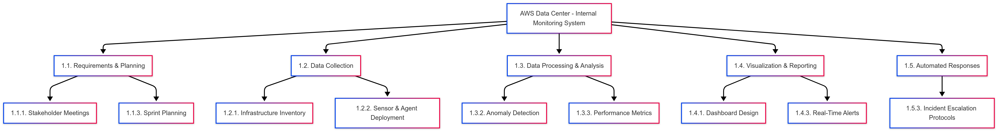

# Project Plan

The project plan consists of a high-level work breakdown structure (WBS) for the five key tasks we have identified.

## WBS


The WBS is created using Mermaid.

### Tasks

**AWS Data Center - Internal Monitoring System**

**1.1. Requirements & Planning**

- 1.1.1. Stakeholder Meetings
- 1.1.3. Sprint Planning

**1.2. Data Collection**

- 1.2.1. Infrastructure Inventory
- 1.2.2. Sensor & Agent Deployment

**1.3. Data Processing & Analysis**

- 1.3.2. Anomaly Detection
- 1.3.3. Performance Metrics

**1.4. Visualization & Reporting**

- 1.4.1. Dashboard Design
- 1.4.3. Real-Time Alerts

**1.5. Automated Responses**

- 1.5.3. Incident Escalation Protocols

### Source Code

```jsx
graph TD
    A["AWS Data Center - Internal Monitoring System"]
    A --> B["1.1. Requirements & Planning"]
    A --> C["1.2. Data Collection"]
    A --> D["1.3. Data Processing & Analysis"]
    A --> E["1.4. Visualization & Reporting"]
    A --> F["1.5. Automated Responses"]

    B --> B1["1.1.1. Stakeholder Meetings"]
    B --> B3["1.1.3. Sprint Planning"]

    C --> C1["1.2.1. Infrastructure Inventory"]
    C --> C2["1.2.2. Sensor & Agent Deployment"]

    D --> D2["1.3.2. Anomaly Detection"]
    D --> D3["1.3.3. Performance Metrics"]

    E --> E1["1.4.1. Dashboard Design"]
    E --> E3["1.4.3. Real-Time Alerts"]

    F --> F3["1.5.3. Incident Escalation Protocols"]
```
